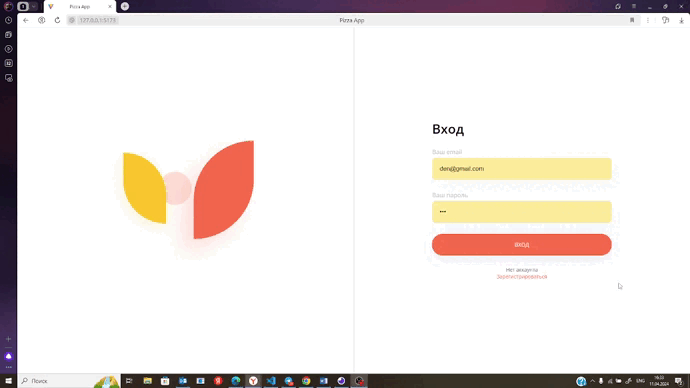

pizza-app - веб-приложение для выбора и заказа еды.

## Результат работы

Общий обзор функционала приложения 

## Требования к системе

- система должна быть многопользовательсткая и с возможностью регистрации.

Должны быть реализованы следующие страницы:

- Страница логина для пользователя.
- Страница регистрации для пользователя.
  регистрация состоит из полей -  email, пароль, имя

Для авторизованных пользователей должны быть реализованы следующие страницы:

Общий интерейс приложения.
приложение визуально разделено на 2 части. Слева располагается фиксированная часть, состоящая из аватарки, имени и Имейла. Ниже находятся активные кнопки выбора "Меню" и "Корзина". в самом низу страницы есть кноака "Выход", читобы сменить пользователя и покинуть аккаунт. 

в правой части, в зависимость от выбора, отображаются следующие страницы 

- Меню 
Состоит из нескольких разворачивающихся при нажатии карточек. в свернутом виде имеют фото блюда и информация о цене, рейтинге, названии,и состава блюда. В верхнем правом углу есть кнопка добавить в корзину.  

-Развёрнутая карточка товара. 
Имеет заголовок с названием товара и кнопку назад слева от него. Сама карточка состоит из фото, цены, рейтинга, состава и кнопки добавить в корзину. 

-Корзина.
Состоит из заголовка и блока подсчёта заказа:Итог, доставка, конечный итог. а так же кнопки "выбрать ещё" если корзина пуста и кнопок "выбрать ещё" и "оформить", если в корзину добавлены товары. Если в корзине есть добавленные товары, то они отображаются в верхней части страницы в виде мини-фото названия и цены. в правой части напротив товара есть 3 кнопки: "уменьшить" "увеличить" и "удалить" заказ. между первыми двумя кгнопками расположен счётчик количества.

-Страница выбора аватарки. 
При нажатии в левой части на аватарку открывается дополнительная страница с выбором из 6 вариантов. При нажатии на понравившуюся она становится основной и не меняется при обновлении или переходе на другие страницы приложения. 

Для администраторов должны быть реализованы следующие страницы:

- Главная страница: содержит список вещей с возможностью удаления.
- Страница со списком пользователей с возможностью удаления.
- Страница со списком категорий с возможностью добавления и удаления.
- Все редактируемые поля должны иметь соответствующую валидацию.

## Реализация

**Управление разработкой**

**Frontend:**

- TypeScript
- CSS
- Redux
- React

***

**Backend:**

- Insomnia

